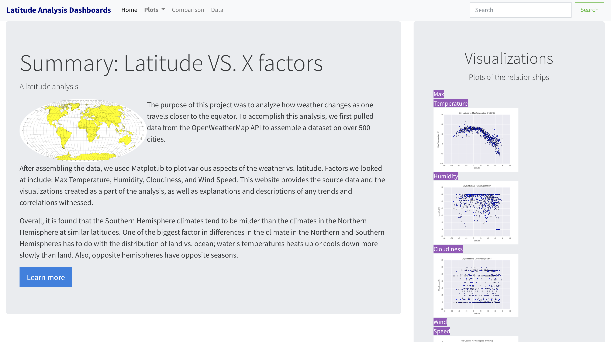
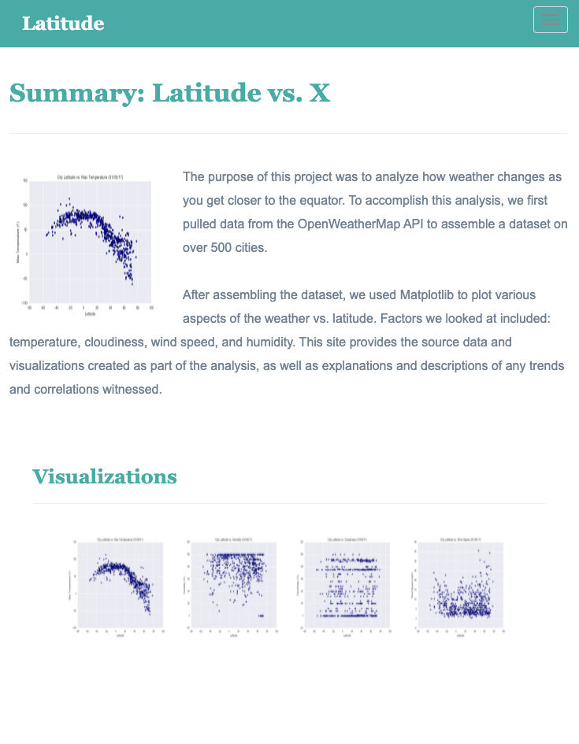

# Web-Design-Challenge - Latitude Analysis

Use `HTML`, `CSS`, `Bootstrap` to create a Web Visualization Dashboard to do a latitude analysis.

## Navigation of the repo: Submission

* **The repo is published [here](https://qianyuema.github.io/Web-Design-Challenge/WebVisualizations_dashboards/landing_page).**
* The **html** files are contained in the folder corresponding to the challenge **WebVisualizations**.

## Objectives

To create a visualization dashboard website using visualizations created in a past challenge. Specifically, the [weather data](Resources/cities.csv) will be plotted.

In building this dashboard, the following will be created:
* the individual pages for each plot 
* a means by which we can navigate between the individual pages
* a landing page where a comparison of all of the plots could be seen
* a page where where the data used to build them could be viewed

### Website Requirements
For reference, see the ["Screenshots" section](#screenshots) below.

The website must consist of 7 pages total, including:

* 1 [landing page](#landing-page) containing:
  * An explanation of the project.
  * Links to each visualizations page. There should be a sidebar containing preview images of each plot, and clicking an image should take the user to that visualization.
* 4 [visualization pages](#visualization-pages), each with:
  * A descriptive title and heading tag.
  * The plot/visualization itself for the selected comparison.
  * A paragraph describing the plot and its significance.
* 1 ["Comparisons" page](#comparisons-page) that:
  * Contains all of the visualizations on the same page so we can easily visually compare them.
  * Uses a Bootstrap grid for the visualizations.
    * The grid must be two visualizations across on screens medium and larger, and 1 across on extra-small and small screens.
* 1 ["Data" page](#data-page) that:
  * Displays a responsive table containing the data used in the visualizations.
    * The table must be a bootstrap table component. ([Hint](https://getbootstrap.com/docs/4.3/content/tables/#responsive-tables))
    * The data must come from exporting the `.csv` file as HTML, or converting it to HTML. Try using a tool you already know, pandas. Pandas has a nifty method approprately called `to_html` that allows you to generate a HTML table from a pandas dataframe. See the documentation [here](https://pandas.pydata.org/pandas-docs/version/0.17.0/generated/pandas.DataFrame.to_html.html).

`Bootstrap` must be used. This includes using the Bootstrap `navbar` component for the header on every page, the bootstrap table component for the data page, and the Bootstrap grid for responsiveness on the comparison page.

The website must, at the top of every page, have a navigation menu that:

* Has the name of the site on the left of the nav which allows users to return to the landing page from any page.
* Contains a dropdown menu on the right of the navbar named "Plots" that provides a link to each individual visualization page.
* Provides two more text links on the right: "Comparisons," which links to the comparisons page, and "Data," which links to the data page. The [weather data](Resources/cities.csv) may be used; or choose another dataset. Alternatively, the included [cities dataset](Resources/cities.csv) may be used, and pull the images from the [assets folder](Resources/assets).
* Is responsive (using `CSS media queries` for the navigation menu). The nav must have similar behavior as the screenshots ["Navigation Menu" section](#navigation-menu) (notice the background color change).
* Be sure your website works at all window widths/sizes.

Finally, the website must be deployed to GitHub pages, with the website working on a live, publicly accessible URL as a result.

When finished, submit to BootcampSpot the links to 1) the deployed app and 2) the GitHub repository.

### Bonuses

* Use a different dataset! The requirements above still hold, but make it your own.
* Use a Bootstrap theme to customize your website. A tool like [`Bootswatch`](https://bootswatch.com/) may be used. Make it look snazzy, give it some attitude. If using this, be sure you also meet all of the requirements listed above.
* Add extra visualizations! The more comparisons the better, right?
* Use meaningful glyphicons next to links in the header.
* Have visualization navigation on every visualizations page with an active state. See the screenshots below.

- - -

### Screenshots

This section contains screenshots of each page that is built, at varying screen widths. 

#### Landing page

Large screen:

Small screen:

#### Comparisons page

Large screen:

Small screen:

#### Data page

Large screen:

Small screen:

#### Visualization pages

You'll build four of these, one for each visualization. Here's an example of one:

Large screen:

Small screen:

#### Navigation menu

Large screen:

Small screen:

